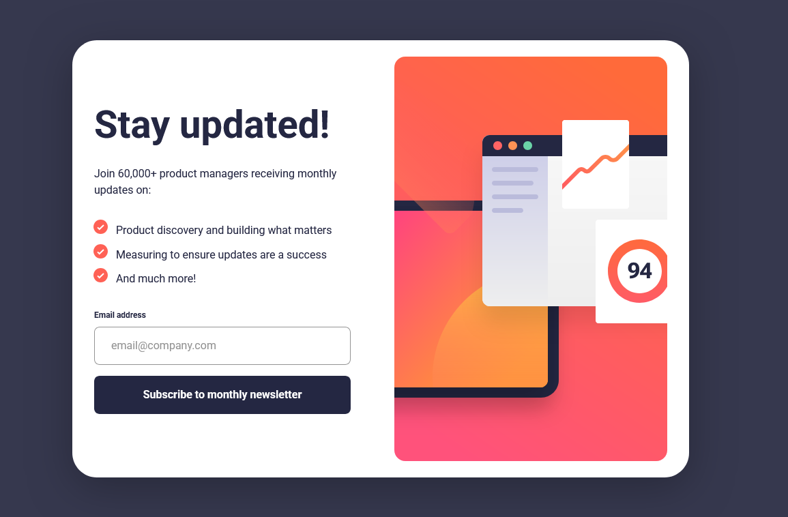

# Frontend Mentor - Newsletter sign-up form with success message solution

This is a solution to
the [Newsletter sign-up form with success message challenge on Frontend Mentor](https://www.frontendmentor.io/challenges/newsletter-signup-form-with-success-message-3FC1AZbNrv).
Frontend Mentor challenges help you improve your coding skills by building realistic projects.

## Table of contents

- [Overview](#overview)
    - [The challenge](#the-challenge)
    - [Screenshot](#screenshot)
    - [Links](#links)
- [My process](#my-process)
    - [Built with](#built-with)
    - [What I learned](#what-i-learned)
    - [Continued development](#continued-development)
- [Author](#author)
- [Acknowledgments](#acknowledgments)

## Overview

### The challenge

Users should be able to:

- Add their email and submit the form
- See a success message with their email after successfully submitting the form
- See form validation messages if:
    - The field is left empty
    - The email address is not formatted correctly
- View the optimal layout for the interface depending on their device's screen size
- See hover and focus states for all interactive elements on the page

### Screenshot

### Links

- Solution URL: [https://github.com/Leonardo76/newsletter-sign-up-with-success-message.git](https://github.com/Leonardo76/newsletter-sign-up-with-success-message.git)
- Live Site URL: [https://newsletterfmlc.netlify.app](https://newsletterfmlc.netlify.app)

## My process

### Built with

- Semantic HTML5 markup
- CSS custom properties
- Flexbox
- CSS Grid
- Mobile-first workflow
- [React](https://reactjs.org/) - JS library
- [Next.js](https://nextjs.org/) - React framework
- Tailwind CSS - for classes and shadcn
- Shadcn - for popup/modal/dialog
- React Hook Form - for validation
- Classnames - for managing classes
- Framer Motion - for animations
- React Responsive - for breakpoints

### What I learned

I started learning shadcn and react-hook-form (but I still have to learn them).

If the SVG images are big, browsers have some problems loading them (there is a delay in rendering the page). This is the
reason I preferred to load all SVG at the start of the app. <picture> element load images (sources) when necessary (
depending on screen size). This will introduce a delay when rendering the page that is observable when switching between 
mobile/tablet/desktop.

### Continued development

I intend to continue to learn React, shadcn, react-hook-form and some Zod.

## Author

- Frontend Mentor - [@Leonardo76](https://www.frontendmentor.io/profile/Leonardo76)

## Acknowledgments

Thanks Yazdun Fadali for introducing me in forms validation. See his [article](https://www.freecodecamp.org/news/how-to-validate-forms-in-react).
